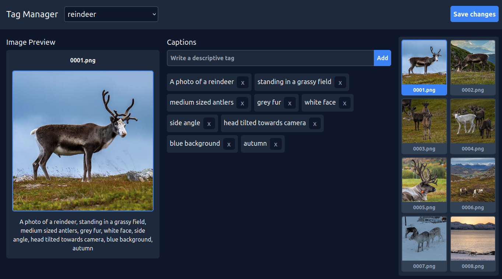

# Tag Manager

A simple tag manager for adding descriptive captions to training data.

## Features

Tag Manager allows you to load a dataset of images, customise the captions that should be used for training, and save them in a text file alongside the existing image file.



## Requirements

- Git
- Docker + Docker Compose

## Getting Started

Clone the repo to your desired location and change directory in your terminal.

```sh
git clone https://github.com/nerdenough/tag-manager.git <target-path>
cd <target-path>
```

Start up both the API and the App services through `docker-compose`.

```sh
docker-compose up
```

The web app will now be running at http://localhost:5173.

## Adding a Dataset

Add dataset images in a custom subfolder within `./datasets`. This is required to open the dataset in the tag manager.

When captions are added and saved through the web app a `.txt` file containing the captions will be written with the same name as the image file.
